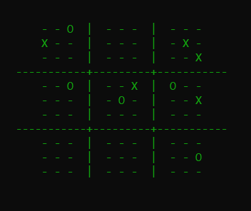

# Ultimate-Tic-Tac-Toe (linguagem C)
## Tópicos de Explicação e Organização do Programa

  Inicialmente, para o desenvolvimento do programa, foi importante pensar numa estratégia fácil e adequada à criação dos mini tabuleiros e do tabuleiro grande. A estratégia utlizada basou-se na criação de um vetor alocado dinamicamente, com tamanho 9 e “dentro” de cada posição do vetor criar uma estrutura com uma matriz 3x3, para representar o mini tabuleiro, e ainda, uma variável do tipo inteiro que assume um valor caso a matriz se encontre totalmente preenchida e outro caso isso não se verifique. 

  Ao executar o programa, o utilizador depara-se com uma interface onde lhe é prestada ajuda e explicado a forma como se encontra organizado o jogo, nomeadamente os números dos tabuleiros e como inserir nos mini tabuleiros, através de coordenadas, os caracteres “X” ou “O”. 

  Para além da explicação inicial, é mostrado ao utilizador um menu com as seguintes opções de jogo: 
  
  1.	Jogar contra o computador;
  2.	Jogar com outro jogador;
  3.	Retomar o último jogo, caso esse exista. 

  No decorrer do jogo, é pedido alternadamente a cada um dos utilizadores que introduza as coordenadas, de modo que assim seja inserido, no mini tabuleiro, o símbolo correspondente a cada jogador.

  Após a introdução e verificação das coordenadas, é apresentado o tabuleiro de jogo com todas as jogadas até então, para facilitar o visionamento do jogo.

  Um aspeto importante, é que sempre que é a vez de um dos utilizadores jogar, é lhe perguntado se deseja ver as últimas x jogadas, com x ∈ [1;10]. Em caso afirmativo, é mostrado na consola as jogadas da mais antiga para a mais recente. 

  Sobre as funções de gestão de informação e manipulação de listas e ficheiros, caso o utilizador opte por selecionar a opção 3 – recuperar o último jogo – o conjunto de funções presentes no ficheiro “funcoes_importantes.c” vai assegurar isso mesmo. 

É de notar que estas funções estão constantemente a ser utilizadas durante o jogo, pois sempre que se pede coordenadas aos jogadores é crucial guardar essa informação, quer nas listas ligadas, para se poder recuperar as últimas x jogadas, quer no ficheiro binário, para se poder recuperar, no futuro, a totalidade do jogo. Estas estratégias de armazenamento das jogadas foram adotadas uma vez que, havendo a possibilidade de o jogador interromper o jogo, é importante estar sempre a salvar cada jogada.

  Por fim, mas não menos importante, sempre que o jogador introduz um caracter no mini-tabuleiro, é verificado se este venceu esse mini tabuleiro e, caso isso se verifique, o tabuleiro fica bloqueado, ou seja, fica totalmente preenchido pelo caracter do jogador que venceu.
  
  
  

  Concluindo, após se verificar um vencedor, ou um empate, as funções que o verificam retornam um valor que indicam à  -função jogar-  para parar o ciclo de solicitação de jogadas aos utilizadores e, após isto, é pedido ao jogador um nome para o ficheiro de texto onde vão ficar descritas todas as jogadas feitas naquele jogo. 
  
   
  
(detalhes mais completos no relatório)
